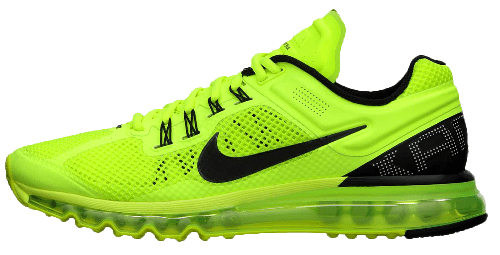

```markdown
# Nike Product Card



## Description
This project is a product card for Nike shoes, showcasing different sizes, colors, and a "Buy Now" option. It includes interactive elements and dynamic visual effects on hover.

## Technologies
- HTML5
- CSS3 (including CSS animations)
- Google Fonts (Poppins)

## Features
- Interactive product card with size and color options
- Buy Now button with a hover effect
- Dynamic visual effects on hover

## Preview
Include a screenshot or gif showcasing the product card here.

## Installation
1. Clone the repository:
   ```bash
   git clone https://github.com/your-username/nike-product-card.git
   ```
2. Open the `index.html` file in your web browser.

## Usage
- Explore different sizes and colors by interacting with the buttons.
- Hover over the card to see dynamic visual effects.
- Click on the "Buy Now" button to initiate a purchase (Note: This is a static representation; no actual purchase functionality is implemented).

## Contributing
Contributions are welcome! If you have ideas for improvements or new features, feel free to fork the repository and create a pull request.

### Getting Started
1. Fork the repository.
2. Clone your forked repository to your local machine.
   ```bash
   git clone https://github.com/your-username/nike-product-card.git
   ```
3. Make your changes.

### Making Contributions
1. Create a new branch for your contribution.
2. Make your changes, whether it's adding new features, fixing bugs, or improving existing code.
3. Commit your changes with a meaningful message.

### Creating a Pull Request
1. Open a Pull Request (PR) by navigating to the [Pull Requests](https://github.com/your-username/nike-product-card/pulls) section of your repository.
2. Click the "New Pull Request" button and select your fork's branch and the main repository's branch you want to merge into.
3. Provide a clear title and description for your PR, explaining the purpose of your changes.
4. Click "Create Pull Request" to submit your changes for review.

## License
The Nike Product Card is open-source and distributed under the MIT License. Feel free to use, modify, and distribute the code as per the terms of the license.
```

This updated README.md focuses more on the product card aspect of the project. Feel free to adjust it further to better suit your preferences or project specifics.